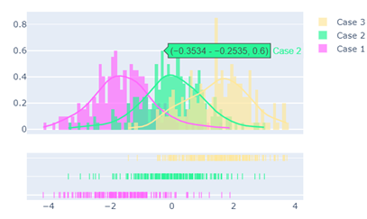

# MonteCarlo

### 簡介

* 蒙地卡羅模擬：
    透過多次隨機抽樣和模擬，獲得地下水流的多種可能性，並**量化**地下水流的**不確定性 (Uncertainty)**，提高模型預測的準確性和可靠性

* 模擬方法:
    1. 定義參數的**機率密度函數 (PDF)**，通常可以根據經驗公式建立。
    2. 在定義好的 PDF 進行隨機抽樣，生成**隨機場 (realization)**，得到相應的地下水流場。
    3. 反覆步驟1和2。
    4. 對於步驟3得到的 n 次模擬結果，進行統計分析，例如計算平均值、標準差、分位數等，得到一個代表模擬結果的統計分佈。
    5. 根據得到的統計分佈，進行風險評估或其他相關應用，例如計算某個水位或通量的概率分布，或計算不同水位或通量條件下的最壞情況等。

* 使用工具
    * 數值地下水模擬工具：FEFLOW 7.3

    * 腳本語言：Python 3.8.6

---

### 範例

1. 以 **水力傳導係數 (Hydrauli Conductivity, K)** 為實驗的不確定性參數

2. 根據經驗式定義 K 的 PDF

3. 利用 `python` 模組 `stats` 生成 n 次隨機抽樣之 K 值

4. 進行蒙地卡羅模擬
    * 將抽樣之 K 值以 `ifm` 設定至模型中
    * 每設定一次，就進行模擬並記錄流速 (velocity)
    * 反覆上述 n 次

5. 將 n 次模擬之流速結果可視化 (`matplotlib`, `seaborn`, `plotly`, ...)
    